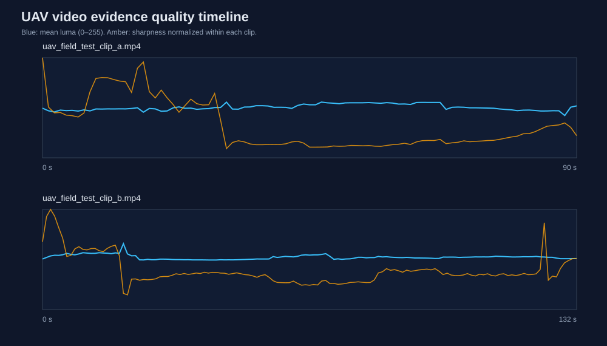

# UAV Flight-Video Quality Audit

[](https://github.com/Aleck-Tao/uav-flight-video-quality-audit/actions/workflows/ci.yml)

An exposure and sharpness audit of two original outdoor UAV field-test videos. It samples the MP4 files at 1 Hz, resizes frames to 180 pixels wide, and identifies intervals worth inspecting before using the footage in a perception experiment.



## Findings in the released clips

| Clip | Duration | Samples | Mean luma | Median sharpness | Low-sharpness samples | Max dark pixels | Max clipped pixels |
|---|---:|---:|---:|---:|---:|---:|---:|
| A | 91.33 s | 91 | 128.62 | 254.5 | 0 | 4.41% | 0.55% |
| B | 132.90 s | 133 | 133.41 | 216.7 | 2 | 1.94% | 1.09% |

The most useful follow-up is **Clip B around 20–21 seconds**. Its Laplacian variance falls to 100.0 and 90.6, below the within-clip cutoff of 103.1. Mean luma reaches 167.8 at the 20-second sample, and the changes from preceding samples are 46.0 and 44.6 luma units. The coincident changes flag a local visual transition; the metrics alone cannot distinguish motion blur, a change of scene texture, and exposure adjustment.

Across the 224 sampled frames, dark and clipped pixel fractions stay below 4.41% and 1.09%, respectively. There is no widespread black-frame or highlight-clipping failure at these sampled instants. A 1 Hz pass can still miss a brief defect between samples.

The table's sharpness values are descriptive, not a ranking of the two cameras or recordings. Laplacian variance responds to texture and resizing as well as focus. Even though both clips are resized to the same width, a scene with more edges can score higher without being more useful for a particular vision task.

The [per-frame measurements](results/frame_metrics.csv) give the timestamps behind these observations. [summary.json](results/summary.json) records the aggregate values, source dimensions, durations and file hashes; [report.md](results/report.md) is the generated summary.

## Run the audit

From a checkout, with Python 3.12:

```bash
python -m pip install -e .
videoaudit
```

This reads [data/videos](data/videos/) and regenerates the CSV, JSON, Markdown report and timeline in `results/`. CI runs the same audit and checks the committed output. Metric tests are available with:

```bash
python -m unittest discover -s tests -v
```

## How the flags are calculated

Luma uses Rec. 709 RGB weights on a 0–255 scale. Pixels below 16 are counted as dark; those above 240 as clipped. Sharpness is the variance of a four-neighbour Laplacian. The low-sharpness cutoff is calculated separately for each clip as `max(20, Q1 − 1.5 × IQR)`; a clip with consistently poor detail may therefore produce few relative outliers. Temporal change is the mean absolute luma difference between consecutive one-second samples, without motion compensation.

These measurements help select video segments for closer inspection. They describe image quality and do not measure pose error or flight autonomy. Sampling and metric definitions are in [methodology.md](docs/methodology.md).

The original MP4 bytes are preserved; their sizes and hashes are listed in the [media manifest](data/videos/MEDIA_MANIFEST.md). Code is [MIT licensed](LICENSE). Video media remain copyright Yuanyuan Tao and are supplied for academic/research review under the [media notice](MEDIA_NOTICE.md).

Related: [multi-sensor diagnostics](https://github.com/Aleck-Tao/uav-multisensor-diagnostics) · [mission interface](https://github.com/Aleck-Tao/safety-constrained-uav-mission-interface) · [portfolio](https://github.com/Aleck-Tao/computer-vision-autonomous-systems-portfolio).
